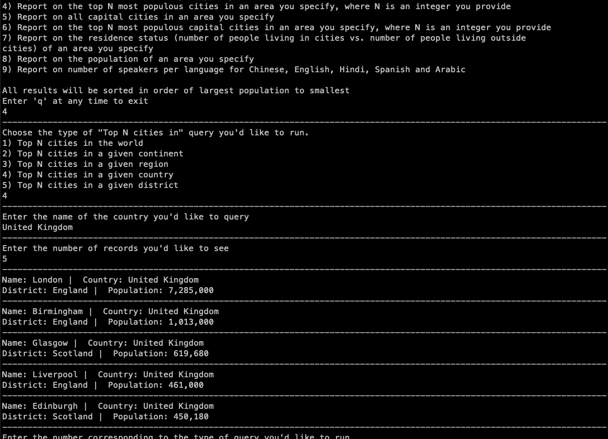

# SEM Group Project

Starring: Lukas Paling and Marco De Luca as the developers or "Script Monkeys"

With Craig Gordon as the Scrum Master or "Scrumbag" and Luke Scanlan as the lead developer or "Head Honcho"

## Overview of the application, and its functionality
The application:
- Creates a docker container with the world database open for connections
- Prompts the user in the console to select a report type
- Runs SQL queries against the database that generate the user's requested report
- Presents the output to the user
- Allows the user to exit at any point in the process
- Loops back to allow the user to select another query

## Requirements Met

32 requirements of 32 requirements have been implemented, which is 100%

| ID  |                                                  Name                                                  |  Met  |                   Screenshot                           |
|----:|:-------------------------------------------------------------------------------------------------------|------:|-------------------------------------------------------:|
| 1.1 |  All the countries in the world organised by largest population to smallest.                           |  Yes  |         |
| 1.2 |  All the countries in a continent organised by largest population to smallest.                         |  Yes  |     |
| 1.3 |  All the countries in a region organised by largest population to smallest.                            |  Yes  |        |
| 2.1 |  The top N most populous countries in the world where N is provided by the user.                       |  Yes  |         |
| 2.2 |  The top N most populous countries in a continent where N is provided by the user.                     |  Yes  |     |
| 2.3 |  The top N most populous countries in a region where N is provided by the user.                        |  Yes  |        |
| 3.1 |  All the cities in the world organised by largest population to smallest.                              |  Yes  |         |
| 3.2 |  All the cities in a continent organised by largest population to smallest.                            |  Yes  |     |
| 3.3 |  All the cities in a region organised by largest population to smallest.                               |  Yes  |        |
| 3.4 |  All the cities in a country organised by largest population to smallest.                              |  Yes  |       |
| 3.5 |  All the cities in a district organised by largest population to smallest.                             |  Yes  |      |
| 4.1 |  The top N most populous cities in the world where N is provided by the user.                          |  Yes  |         |
| 4.2 |  The top N most populous cities in a continent where N is provided by the user.                        |  Yes  |     |
| 4.3 |  The top N most populous cities in a region where N is provided by the user.                           |  Yes  |        |
| 4.4 |  The top N most populous cities in a country where N is provided by the user.                          |  Yes  |       |
| 4.5 |  The top N most populous cities in a district where N is provided by the user.                         |  Yes  |      |
| 5.1 |  All the capital cities in the world organised by largest population to smallest.                      |  Yes  |         |
| 5.2 |  All the capital cities in a continent organised by largest population to smallest.                    |  Yes  |     |
| 5.3 |  All the capital cities in the region organised by largest population to smallest.                     |  Yes  |        |
| 6.1 |  The top N most populous capital cities in the world where N is provided by the user.                  |  Yes  |         |
| 6.2 |  The top N most populous capital cities in a continent where N is provided by the user.                |  Yes  |     |
| 6.3 |  The top N most populous capital cities in a region where N is provided by the user.                   |  Yes  |        |
| 7.1 |  The population of people, people living in cities, and people not living in cities in a continent.    |  Yes  ||
| 7.2 |  The population of people, people living in cities, and people not living in cities in a region.       |  Yes  |   |
| 7.3 |  The population of people, people living in cities, and people not living in cities in a country.      |  Yes  |  |
| 8.1 |  The population of the world                                                                           |  Yes  |         |
| 8.2 |  The population of a specified continent                                                               |  Yes  |     |
| 8.3 |  The population of a specified region                                                                  |  Yes  |        |
| 8.4 |  The population of a specified country                                                                 |  Yes  |       |
| 8.5 |  The population of a specified district                                                                |  Yes  |      |
| 8.6 |  The population of a specified city                                                                    |  Yes  |          |
| 9.1 |  The number of people who speak the following the following languages from greatest number to smallest, including the percentage of the world population:                                           |  Yes  | |
